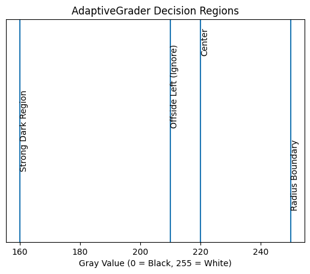
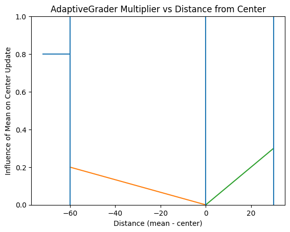

# problem
Marking answers based solely on the average gray value and a fixed threshold may not be reliable.

Consider a scenario where one student's answers are heavily darkened, while some erased answers have gray values similar to another student's lightly marked answers. In such cases, applying a global threshold can lead to incorrect classifications:

- If the threshold is too low, erased answers might be marked as valid.
- If the threshold is too high, valid but lightly marked answers might not be detected.

Since pixel intensity ranges from 0 (black) to 255 (white), variations in shading, erasing, and scanning conditions make simple thresholding insufficient for robust answer detection.

# solve

To address the limitations of fixed global thresholding, this project introduces an adaptive, behavior-aware decision model.

Instead of relying on a static threshold, the system performs dynamic threshold estimation based on each student's marking characteristics. The algorithm operates in a streaming manner, receiving sequential average gray values (representing bubble darkness) and producing real-time classification decisions.

The model incrementally updates its internal decision boundary as new observations arrive. This allows it to learn the marking intensity distribution of each individual student and adjust its sensitivity accordingly.

In other words, the system performs online normalization and progressive boundary refinement, enabling:

- Behavior-aware classification
- Robust separation of erased marks and lightly shaded answers
- Reduced false positives under heavy shading
- Reduced false negatives under light shading
- Immediate output without requiring full-sheet batch analysis

The decision process improves over time as more answer regions are processed, effectively acting as a lightweight online adaptive classifier tailored to each response sheet.

# how it works

## ⚙️ Adaptive Grading Algorithm

🧠 Conceptual Overview

The AdaptiveGrader class implements a behavior-aware, streaming decision model for OMR answer detection.

Instead of using a static threshold, the system maintains a dynamic decision center (center) that continuously adapts based on incoming gray value observations.

The algorithm processes bubble mean intensities sequentially and updates its decision boundary using asymmetric weighted adjustments depending on how far the input deviates from the current center.

This allows the system to:

Avoid early bias from initial blank inputs

React quickly to strong markings

Adjust smoothly to moderate shading

Prevent threshold drift toward only darker values

## 🧩 Core Variables
### `center`

Dynamic decision boundary (adaptive threshold).
It moves over time based on observed gray values.

### `offside_left`

A fixed upper bound used to ignore very bright inputs.

Since sheet brightness is normalized beforehand, unmarked bubbles across students have similar high gray values.
This prevents the algorithm from incorrectly adapting when initial inputs are blank.

### Condition:

if mean > offside_left → ignore input
### `offside`

Defines a strong deviation region on the dark side.

If the input gray value is significantly darker than the center:

dis = mean - center
if dis < offside:

The algorithm performs a rapid adaptation:

center = (mean * 0.8) + (center * 0.2)

This allows the system to quickly shift toward genuinely dark markings and correct early misalignment caused by blank initial inputs.

### `radius`

Defines a soft adjustment region near the center.

This prevents the threshold from drifting only toward darker values and ensures smoother behavior for moderate deviations.

## 🔄 Update Strategy (Three Regions)

Let:

dis = mean - center

The update rule depends on which region the input falls into:

### 1️⃣ Ignored Region (Very Bright Inputs) mean > offside_left

No update occurs.

This stabilizes the model during early streaming stages when blank answers dominate.

### 2️⃣ Strong Dark Region (dis < offside)

Rapid correction:

center = 0.8 * mean + 0.2 * center

This acts like a “panic correction” when encountering clearly filled answers.

It ensures the algorithm does not continue assuming blank behavior.

### 3️⃣ Moderate Dark Region (offside ≤ dis < 0)

Weighted adaptive update:

multiplier = (dis / offside) * 0.2
center = mean * multiplier + center * (1 - multiplier)

The farther the input is from the center, the stronger the adjustment.

This creates distance-sensitive adaptation.

### 4️⃣ Soft Boundary Region (0 ≤ dis < radius)

Symmetric smoothing update:

multiplier = (dis / radius) * 0.3
center = mean * (1 - multiplier) + center * multiplier

Here:

The farther the value is from the center,

The smaller the influence of the input becomes,

Preventing overreaction near the boundary.

This keeps the threshold from drifting excessively.

### 🧾 Answer Aggregation Logic

The system processes bubbles sequentially.

num tracks option index (1–4).

After every 4 bubbles, a final answer is produced.

If multiple bubbles are detected as marked → "*" is assigned.

Otherwise, the detected option index is appended.

This allows:

Real-time streaming grading

No need for full-sheet batch processing

Incremental output generation

### 📊 Behavioral Interpretation

Mathematically, this algorithm behaves like:

A one-dimensional adaptive classifier

With asymmetric learning rates

Using distance-weighted boundary updates

Operating in an online streaming setting

It does not explicitly model distributions but implicitly learns the marking intensity profile of each individual student

# digrams

## 📊 Decision Regions

### ⚠️ Initialization Strategy

At initialization, the `center` is intentionally placed to the left of the `offside_left` boundary.

This ensures that during the early streaming phase, strong dark inputs immediately trigger the aggressive update mechanism.

In other words, the model is biased toward rapid adaptation at startup to avoid being misled by initial blank bubbles.

---

## 📈 Update Multiplier vs Distance

